## Capstone Project - Containerization and Container Orchestration

## Introduction

In today's fast-paced software development landscape, containerization has emerged as a pivotal technology for deploying and scaling applications. This Capstone Project focuses on containerizing a simple static website using Docker and orchestrating its deployment through Kubernetes. The project simulates a real-world scenario where a company's landing page is developed using basic HTML and CSS, containerized with Docker, and then deployed to a Kubernetes cluster. The goal is to ensure that the application can be accessed via Nginx, offering a highly portable, scalable, and consistent deployment environment.

Throughout this project, we leveraged modern DevOps tools like Docker to create an image of the frontend application, and Kubernetes to manage the deployment in a cluster environment. This comprehensive documentation outlines each phase of the process, including setting up the project, initializing version control, building and pushing Docker images, deploying to a Kubernetes cluster using Kind, and finally, exposing the application via Kubernetes services. The end result is a fully operational static website that runs efficiently in a containerized environment, demonstrating the power of Docker and Kubernetes in modern software development.

## Basic Frontend Application with Docker and Kubernetes

### Task 1: Set up your project

1. Create a new project directory:

    - Open your terminal and create a directory for your project:
    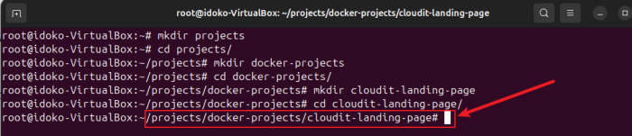

        `mkdir cloudit-landing-page`
        `cd cloudit-landing-page`
2. Create an HTML file (index.html) and a CSS file (styles.css):

    - Use a text editor or code editor to create the following files inside your project directory:

    index.html:
    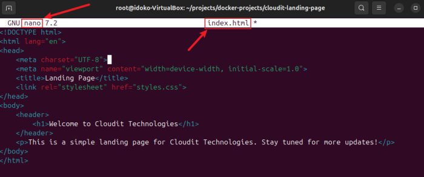

    styles.css:
    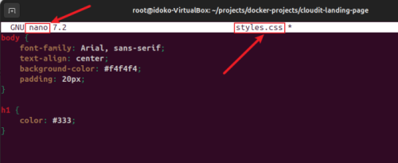

**Explanation:** The HTML and CSS files will serve as the static content for the landing page. These files are simple and demonstrate the basic structure of a webpage.

### Task 2: Initialize Git

1. Initialize a Git repository in your project directory:

    - Inside the cloudit-landing-page directory, run: `git init`

    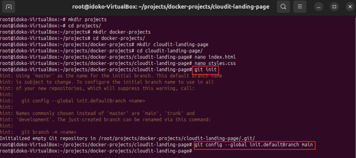

**Explanation:** Initializing a Git repository allows you to track changes in your project, maintain version control, and collaborate with others if necessary.

### Task 3: Git Commit

1. Add and commit your initial code to the Git repository:

    - First, add your files to the staging area: `git add .`

        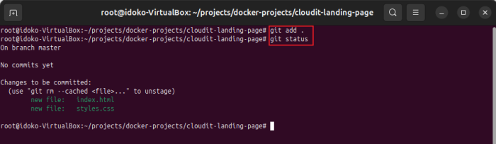

    - Then, commit the changes:

        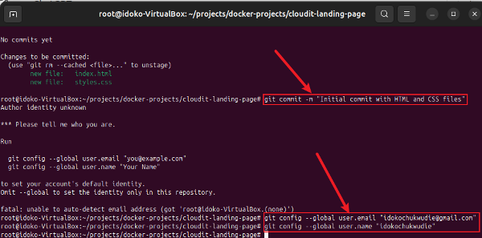

**Explanation:** This step ensures that the code is saved in Git's history and can be reverted to this state if needed in the future.

### Task 4: Dockerize the application

1. Create a Dockerfile in the root directory:

    - Create a file named Dockerfile with the following content:

        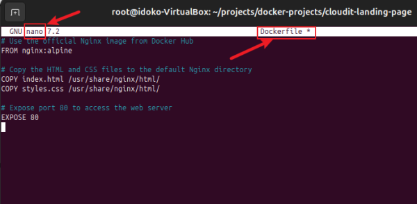

2. Build your Docker image:

    - Run the following command to build the Docker image: `docker build -t your_dockerhub_username/landing-page`

        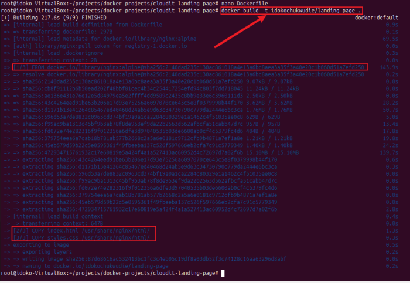

**Explanation:** The Dockerfile is used to specify the base image (Nginx) and to copy your HTML/CSS files into the Nginx web directory. Building the image packages your static website into a container.

### Task 5: Push to Docker Hub

1. Log in to Docker Hub: `docker login`

    - Log in to your Docker Hub account:

2. Push your Docker image to Docker Hub: `docker push your_dockerhub_username/landing-page`

    - After logging in, push the image: 

    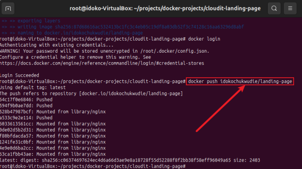

**Explanation:** Pushing your image to Docker Hub makes it publicly accessible, allowing others (or Kubernetes) to pull the image for deployment.

### Task 6: Set up a Kind Kubernetes Cluster

1. Install Kind (Kubernetes in Docker): 

    - Install Kind by following the official documentation: https://kind.sigs.k8s.io/docs/user/quick-start/

2. Create a Kind cluster:

    - Run the following command to create a new Kind cluster: `kind create cluster`

        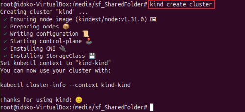

**Explanation:** Kind is a tool for running Kubernetes clusters locally using Docker containers. This setup allows you to simulate a Kubernetes environment on your machine.

### Task 7: Deploy to Kubernetes

1. Create a Kubernetes Deployment YAML file:

    - Create a file named `deployment.yaml` with the following content:

        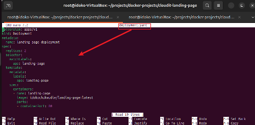

2. Apply the deployment to your cluster:

    - Run the following command: `kubectl apply -f deployment.yaml`

        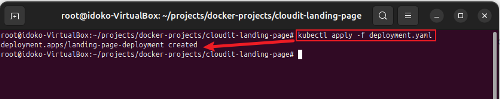

**Explanation:** This YAML file defines a Kubernetes Deployment that pulls your Docker image from Docker Hub and runs two replicas of it in the cluster.

### Task 8: Create a Service (ClusterIP)

1. Create a Kubernetes Service YAML file:

    - Create a file named service.yaml with the following content:

        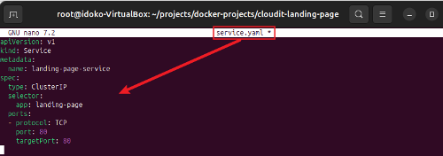

2. Apply the service to your cluster:

    - Run the following command: `kubectl apply -f service.yaml`

        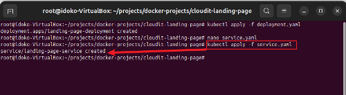

**Explanation:** The Service file defines how Kubernetes exposes your Deployment internally using the ClusterIP service type, which makes the application accessible within the cluster.

### Task 9: Access the Application

1. Port-forward to the service:

    - Use the following command to port-forward the service to your local machine: `kubectl port-forward service/landing-page-service 8080:80`

        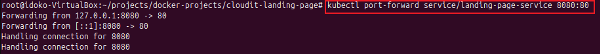

2. Open your browser and visit the application:

    - In your browser, visit `http://localhost:8080` to view your static website.

        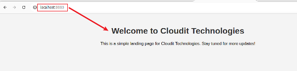
    

## Conclusion

This project successfully demonstrated the power of containerization and orchestration in deploying a static web application. By containerizing the frontend application using Docker, we encapsulated all its dependencies, making the deployment consistent across environments. The use of Kubernetes further illustrated how containers can be managed, scaled, and deployed in a highly available cluster environment.

From the initial project setup, Git version control, Docker image creation, and pushing to Docker Hub, to setting up a local Kubernetes cluster with Kind and deploying the application, each phase reinforced key DevOps concepts. The project showcased the simplicity and power of Nginx as a web server and Kubernetes as a robust platform for managing containerized workloads. Finally, port-forwarding the Kubernetes service allowed for local access to the application, completing the full cycle of containerization and orchestration.

In conclusion, this capstone project provides a foundation for understanding how to deploy web applications using cutting-edge technologies like Docker and Kubernetes, which are critical for scaling modern applications in real-world scenarios.